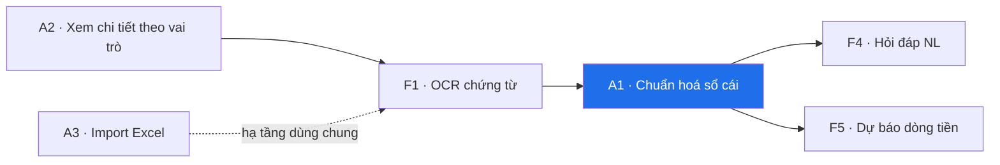
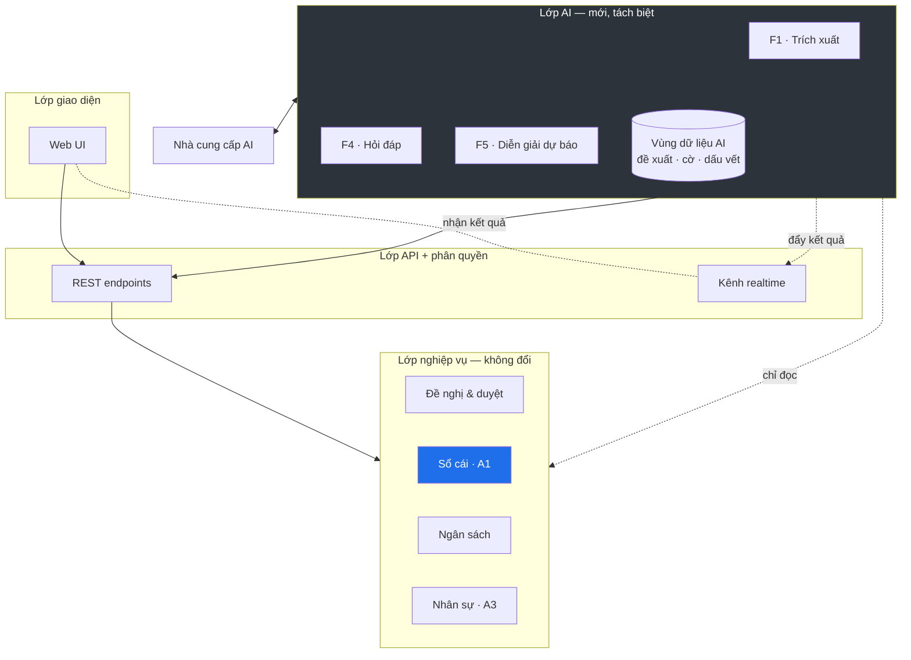

# IFMS — Bản đề xuất cải tiến cho Đồ án 2

> Phạm vi tài liệu: **kiến trúc và giải pháp**. Không mô tả chi tiết triển khai (không class, không SQL, không signature). Chi tiết kỹ thuật từng feature sẽ tách thành implementation note riêng khi bắt đầu code.
>
> Ngày lập: 2026-09-12 · Tiền đề: [ai-features-proposal.md](ai-features-proposal.md)

---

## 1. Định vị: đồ án 1 → đồ án 2

**Đồ án 1** đã xây được một hệ thống **ghi nhận** hoàn chỉnh: ví 4 tầng, bút toán kép, 3 luồng duyệt theo SoD, payroll, nạp/rút qua cổng thanh toán. Hệ thống trả lời tốt câu hỏi *"chuyện gì đã xảy ra?"*.

**Đồ án 2** chuyển trọng tâm sang **ra quyết định**: hệ thống phải trả lời được *"con số này có đúng không?"*, *"tôi hỏi thì nó tra được không?"*, và *"sắp tới sẽ ra sao?"*.

Ba câu hỏi đó ánh xạ thẳng sang ba năng lực AI được chọn:

| Câu hỏi | Năng lực | Mã |
|---|---|---|
| Con số này có đúng không? | Trích xuất & đối chiếu chứng từ | **F1** |
| Tôi hỏi thì nó tra được không? | Hỏi đáp tài chính bằng ngôn ngữ tự nhiên | **F4** |
| Sắp tới sẽ ra sao? | Dự báo dòng tiền & cảnh báo ngân sách | **F5** |

---

## 2. Phát hiện then chốt: F4 và F5 **phụ thuộc** vào chất lượng sổ cái

Đây là điểm quan trọng nhất của bản đề xuất này, và là lý do ba yêu cầu cải tiến bạn nêu ra không phải việc phụ.

F4 phải trả lời được *"quý 3 phòng IT chi bao nhiêu cho marketing"*. F5 phải chiếu số dư về tương lai. **Cả hai chỉ chính xác bằng đúng độ chính xác của lớp dữ liệu bên dưới.** Nếu sổ cái không tổng hợp được theo chiều "khoản mục chi phí", thì không lớp AI nào cứu được — nó sẽ trả lời trôi chảy và sai.

Vì vậy bản đề xuất chia làm hai phần **có thứ tự bắt buộc**:



> **Phần A là nền móng, phần B là giá trị nhìn thấy được.** Làm B trước A sẽ ra một demo đẹp đặt trên dữ liệu không bảo vệ được.

---

## PHẦN A — Cải tiến nền tảng

### A1. Chuẩn hoá nghiệp vụ sổ cái

#### Hiện trạng (đánh giá từ code)

Những gì **đã đúng** và phải giữ:
- Bút toán bất biến — không sửa/xoá, sai thì đảo bằng bút toán ngược
- Mỗi entry lưu `balance_after` → có thể dựng lại số dư tại mọi thời điểm
- Khoá bi quan trên ví khi ghi sổ + `@Version` làm lưới an toàn
- Tách `transaction` (chứng từ) khỏi `ledger_entry` (bút toán) — đúng mô hình

Những gì **còn thiếu so với nghiệp vụ kế toán thật**:

| Khoảng trống | Hệ quả |
|---|---|
| Bút toán chỉ gắn với **ví**, không gắn với **tài khoản kế toán** | Chỉ lập được báo cáo theo ví, không lập được bảng cân đối thử theo khoản mục. Đây chính là thứ F4 cần. |
| Không có ràng buộc bắt buộc **Σ Nợ = Σ Có** ở ranh giới ghi sổ | Cân bằng đang dựa vào "code luôn viết đúng cặp", không có gì chặn nếu viết sai |
| Không có **kỳ kế toán** và cơ chế khoá sổ | Không ngăn được ghi lùi ngày vào kỳ đã chốt |
| Không tách **ngày hạch toán** khỏi **thời điểm ghi nhận hệ thống** | Chi tháng 8 nhưng nhập tháng 9 sẽ rơi sai kỳ |
| Không phân biệt **đã cam kết** (duyệt chưa chi) với **đã thực chi** | F5 không có đầu vào để dự báo |

#### Giải pháp đề xuất

**1. Thêm chiều "tài khoản" vào bút toán.** Mỗi bút toán mang thêm một mã tài khoản kế toán bên cạnh ví hiện có. Ví trả lời *"tiền nằm ở đâu"*, tài khoản trả lời *"bản chất khoản đó là gì"* (tạm ứng / chi phí theo khoản mục / phải trả nhân viên / tiền mặt). Hệ thống danh mục tài khoản nên tối giản — chỉ những tài khoản IFMS thực sự dùng, ánh xạ từ `expense_categories` đã có, **không bê nguyên hệ thống tài khoản doanh nghiệp Việt Nam vào**.

> Đây là thay đổi có giá trị nhất trong phần A: nó vừa làm sổ cái đúng nghiệp vụ hơn, vừa **mở khoá F4**, vừa là nội dung viết được cả một chương báo cáo.

**2. Đưa việc ghi sổ qua một cổng duy nhất.** Mọi bút toán phải đi qua một điểm vào chung, nơi ràng buộc cân bằng được kiểm tra **trước khi** ghi. Không domain nào được tự tạo bút toán lẻ. Việc này biến bất biến kế toán từ "quy ước trong code" thành "ràng buộc được cưỡng chế".

**3. Thêm kỳ kế toán và trạng thái khoá.** Kỳ mở → ghi được; kỳ đã khoá → mọi bút toán bị từ chối, điều chỉnh phải sang kỳ sau. Tận dụng được khái niệm kỳ đã có ở payroll.

**4. Tách ngày hạch toán khỏi timestamp hệ thống**, và phân biệt trạng thái **cam kết** với **thực chi** — đây là đầu vào trực tiếp cho F5.

#### Đánh đổi

Thêm chiều tài khoản làm tăng độ phức tạp khi ghi sổ và cần migrate dữ liệu cũ. Đổi lại, nó là điều kiện cần để có báo cáo tài chính đúng nghĩa. **Chấp nhận đánh đổi này**; nếu không thì F4 nên bị loại khỏi phạm vi, vì không có nền để đứng.

---

### A2. Luồng xem chi tiết theo vai trò

#### Vấn đề

Người duyệt hiện quyết định trong tình trạng thiếu ngữ cảnh: thấy được đề nghị chi, nhưng không thấy ngân sách còn lại, không thấy lịch sử người đề nghị, không thấy tạm ứng đang treo. Đồng thời mỗi vai trò (Accountant / Team Leader / Manager / CFO / Admin) cần **lát cắt khác nhau** trên cùng một thực thể.

#### Giải pháp

**Một tài nguyên, nhiều hình chiếu theo vai trò.** Không nhân bản endpoint cho từng role trên cùng dữ liệu. Thay vào đó: một luồng xem chi tiết dùng chung, và **lớp hình chiếu** quyết định người gọi được thấy trường nào, khối thông tin nào, dựa trên quyền hiện có.

Ba khối thông tin chuẩn cho mọi màn chi tiết (request / project / phase):

1. **Bản thân đối tượng** — dữ liệu gốc
2. **Ngữ cảnh tài chính** — ngân sách còn lại, mức đã tiêu, tạm ứng liên quan, tác động nếu duyệt
3. **Dấu vết** — lịch sử duyệt, chứng từ, thay đổi

Quyền quyết định **độ sâu** của khối 2 và 3, không quyết định có/không có màn hình.

#### Vì sao đây là tiền đề của F1 và F4

Màn chi tiết chính là **nơi kết quả AI hiển thị**: đối chiếu chứng từ của F1 hiện ở khối 3, ngữ cảnh ngân sách mà F4 truy vấn chính là khối 2. Làm sạch lớp này trước thì tính năng AI có chỗ để đứng, không phải vá vào sau.

---

### A3. Import Excel cho phòng ban và nhân sự (Admin)

#### Giải pháp

Tách rõ **ba giai đoạn**, và giai đoạn giữa là điểm mấu chốt:

```
Tải file  →  Đối soát & xem trước  →  Xác nhận ghi
              ↑ dừng ở đây cho tới khi Admin duyệt
```

Giai đoạn giữa bắt buộc phải có: hệ thống phân tích file, **ánh xạ cột → trường dữ liệu**, kiểm tra hợp lệ từng dòng, rồi trả về bản xem trước có phân loại *hợp lệ / cảnh báo / lỗi*. Không ghi bất cứ thứ gì cho tới khi Admin xác nhận.

**Ngữ nghĩa ghi là toàn-phần-hoặc-không** — một lô import hoặc vào hết, hoặc không vào gì. Import nửa vời vào dữ liệu nhân sự là trạng thái không ai muốn dọn.

Tái dùng hạ tầng đọc Excel đã có từ payroll; khác biệt nằm ở tập trường và quy tắc hợp lệ, không phải ở cơ chế.

> **Điểm mở rộng AI (tuỳ chọn, ưu tiên thấp):** bước ánh xạ cột có thể để AI gợi ý khi header không khớp template (`"Lương CB"` → lương cơ bản). Rủi ro thấp vì đầu ra chỉ là bản đồ ánh xạ, luôn qua mắt Admin. **Không đưa vào phạm vi chính** — chỉ làm nếu ba feature AI đã xong.

---

## PHẦN B — Năng lực AI

### Nguyên tắc chung cho cả phần B

Ba ràng buộc dưới đây áp cho mọi tính năng AI, không có ngoại lệ:

1. **AI không ghi vào sổ.** Đầu ra AI luôn là đề xuất nằm ở vùng dữ liệu riêng, tách khỏi sổ cái. Muốn thành bút toán phải qua đúng luồng duyệt của con người.
2. **AI không làm số học.** Mọi con số do hệ thống tính; AI chỉ trích xuất, diễn giải, hoặc chọn công cụ để lấy số.
3. **AI có thể tắt hoàn toàn.** Mất kết nối nhà cung cấp thì hệ thống thoái lui về đúng năng lực đồ án 1 — không màn hình nào chết.

---

### F1 — Trích xuất và đối chiếu chứng từ

#### Bài toán

Nhân viên nhập tay số tiền, ngày, nhà cung cấp — trong khi ảnh chứng từ đã nằm sẵn trong hệ thống. Vừa tốn công, vừa không ai kiểm tra được số nhập có khớp chứng từ hay không.

#### Giải pháp

Hai giá trị, và **giá trị thứ hai mới là cái đáng làm**:

| | Giá trị | Người hưởng |
|---|---|---|
| 1 | Điền sẵn biểu mẫu từ ảnh chứng từ | Người đề nghị — tiện |
| 2 | **Đối chiếu số trích xuất với số người dùng nhập** | Người duyệt — **kiểm soát nội bộ** |

Nếu chỉ làm (1) thì đó là tiện ích. Làm (2) thì đó là một **chốt kiểm soát tự động**: lệch quá ngưỡng cấu hình được → gắn cờ, hiện ở khối "dấu vết" của màn chi tiết (A2) để người duyệt thấy.

#### Vị trí trong kiến trúc

Trích xuất là **bất đồng bộ**. Người dùng tải chứng từ lên, hệ thống nhận việc và trả ngay; kết quả về sau qua kênh realtime đã có. Không chặn thao tác tạo đề nghị — người dùng luôn nhập tay được, AI chỉ rút ngắn đường đi.

#### Ranh giới

- Kết quả trích xuất **không bao giờ tự ghi đè** dữ liệu người dùng nhập — chỉ gợi ý và gắn cờ lệch
- Độ tin cậy thấp → im lặng, không gợi ý sai
- Cần lưu cả bản trích xuất lẫn quyết định cuối của người dùng — đây vừa là dấu vết kiểm toán, vừa là dữ liệu đánh giá

---

### F4 — Hỏi đáp tài chính bằng ngôn ngữ tự nhiên

#### Bài toán

Câu hỏi quản trị thật (*"dự án nào đang vượt ngân sách"*, *"quý rồi phòng IT chi nhiều nhất vào khoản gì"*) hiện phải trả lời bằng cách mở nhiều màn hình và tự cộng. Dashboard chỉ trả lời được những câu đã được thiết kế trước.

#### Giải pháp — và đây là quyết định kiến trúc quan trọng nhất của đồ án 2

Có hai hướng, phải chọn dứt khoát:

| Hướng | Cách hoạt động | Vấn đề |
|---|---|---|
| Sinh truy vấn tự do | AI viết câu truy vấn, hệ thống chạy | Không kiểm soát được phạm vi dữ liệu bị đọc; phân quyền bị vượt mặt; câu truy vấn sai cú pháp hoặc sai ngữ nghĩa đều khó phát hiện |
| **Bộ công cụ có kiểm soát** ✅ | Hệ thống công bố một tập **hàm truy vấn định sẵn**; AI chỉ được chọn hàm và điền tham số | Phạm vi câu hỏi bị giới hạn bởi tập hàm |

**Chọn hướng thứ hai.** Lý do có tính nguyên tắc, không phải sở thích:

- **Phân quyền không thể bị vượt mặt** — mỗi hàm truy vấn tự kiểm quyền y như mọi nghiệp vụ khác trong hệ thống. Nhân viên hỏi xoáy kiểu gì cũng không lấy được dữ liệu ngoài phạm vi của mình. Với hướng sinh truy vấn tự do, điều này gần như không đảm bảo được.
- **Mọi con số đều do hệ thống tính** — đúng nguyên tắc 2.
- **Kiểm thử được** — tập hàm hữu hạn nên phủ test được; câu truy vấn tự do thì không.

Giới hạn phạm vi câu hỏi là **cái giá chấp nhận được**, và bản thân việc phân tích đánh đổi này là một mục đáng viết trong báo cáo.

#### Phụ thuộc

F4 **không thể vượt quá** khả năng tổng hợp của sổ cái. Tập hàm truy vấn chỉ giàu được khi A1 đã thêm chiều tài khoản. Đây là lý do A1 phải xong trước.

#### Trải nghiệm

Câu trả lời trả về dần qua kênh realtime có sẵn. Mỗi câu trả lời **kèm nguồn**: đã gọi hàm nào, tham số gì. Người dùng kiểm chứng được, không phải tin suông.

---

### F5 — Dự báo dòng tiền và cảnh báo ngân sách

#### Bài toán

Hệ thống biết đã chi bao nhiêu, không biết **sắp** chi bao nhiêu. Phòng ban cạn ngân sách là chuyện phát hiện sau khi đã xảy ra.

#### Giải pháp

Phân định rạch ròi hai phần, và đây là điểm mấu chốt về độ tin cậy:

| Phần | Ai làm | Vì sao |
|---|---|---|
| **Tính toán dự báo** | Hệ thống, bằng mô hình tất định | Con số phải lặp lại được và kiểm chứng được |
| **Diễn giải** | AI | Chuyển bảng số thành câu chuyện đọc được |

AI **không dự báo**. AI đọc kết quả dự báo rồi viết ra: *"phòng IT sẽ cạn ngân sách trước giữa tháng 11 nếu giữ tốc độ hiện tại, chủ yếu do ba khoản tạm ứng lớn của dự án X"*. Bỏ AI đi thì vẫn còn con số; con số không phụ thuộc AI.

#### Đầu vào — và vì sao cần A1

Dự báo cần ba lớp dữ liệu:

1. **Đã thực chi** — từ sổ cái
2. **Đã cam kết** — đề nghị đã duyệt chưa giải ngân *(cần A1 tách trạng thái này)*
3. **Định kỳ dự kiến** — lương, chi phí lặp lại

Nếu không có lớp 2, dự báo chỉ là ngoại suy quá khứ và sẽ đánh giá thấp nghĩa vụ sắp tới — sai theo hướng nguy hiểm.

#### Đầu ra

Cảnh báo đẩy qua hạ tầng thông báo có sẵn, theo ngưỡng cấu hình được ở runtime (không hardcode). Cảnh báo là **thông tin, không phải chốt chặn** — không tự động khoá chi tiêu.

---

## 3. Kiến trúc tổng thể

### Vị trí của lớp AI



**Ba điều đọc ra từ sơ đồ này:**

1. Lớp AI **chỉ đọc** lớp nghiệp vụ. Không có mũi tên ghi ngược lại. Đây là bất biến kiến trúc, không phải quy ước.
2. Đầu ra AI nằm ở **vùng dữ liệu riêng**, không trộn vào sổ cái. Xoá sạch vùng này thì tính toàn vẹn tài chính không suy suyển.
3. Gỡ toàn bộ khối AI ra, hệ thống vẫn chạy đủ chức năng đồ án 1.

### Mô hình xử lý

Tác vụ AI có độ trễ cao và có thể thất bại → **không nằm trên đường đi của HTTP request**:

```
Yêu cầu  →  nhận việc, trả ngay  →  xử lý nền  →  lưu kết quả  →  đẩy realtime
                                                    ↑ lưu TRƯỚC, đẩy SAU
```

Thứ tự *lưu trước, đẩy sau* là pattern hệ thống đã dùng cho thông báo — giữ nguyên, không phát minh lại. Đẩy realtime thất bại (người dùng offline) thì kết quả vẫn còn, đọc lại được khi quay lại.

### Nguyên tắc lựa chọn mô hình

Không dùng một mô hình cho mọi việc. Việc nặng về thị giác và suy luận (F1) cần mô hình mạnh; việc phân loại và tóm tắt đơn giản dùng mô hình rẻ. Tiêu chí là **chất lượng tối thiểu chấp nhận được cho từng tác vụ**, đo bằng khung đánh giá, không phải chọn cảm tính.

### Kiểm soát chi phí và rủi ro vận hành

| Cơ chế | Mục đích |
|---|---|
| Hạn mức token theo tháng + giới hạn theo người dùng | Chặn chi phí vượt kiểm soát |
| Ngắt mạch khi nhà cung cấp lỗi | Thoái lui sạch sẽ, không treo giao diện |
| Bộ nhớ đệm kết quả theo nội dung đầu vào | Không xử lý lại cùng một chứng từ |
| Ngưỡng nghiệp vụ đặt trong cấu hình runtime | Chỉnh được khi vận hành, không cần build lại |
| Trừu tượng hoá nhà cung cấp | Đổi nhà cung cấp không phải sửa nghiệp vụ |

### Ranh giới bảo mật cần quyết sớm

- **Dữ liệu lương** có gửi ra dịch vụ ngoài hay không — khuyến nghị: **không**, loại khỏi ngữ cảnh AI. Cần nêu rõ trong phần đạo đức dữ liệu của báo cáo.
- **Mô tả do người dùng nhập là dữ liệu, không phải chỉ thị.** Nội dung người dùng nhập không được phép điều khiển hành vi AI — ranh giới này phải rõ ràng trong thiết kế, vì đây là hệ thống mà người dùng có động cơ thao túng kết quả duyệt.
- Đầu ra AI hiển thị cho ai vẫn tuân thủ đúng phân quyền hiện hành — không có kênh rò rỉ ngang.

---

## 4. Lộ trình

| Giai đoạn | Nội dung | Điều kiện ra |
|---|---|---|
| **1** | A1 · Chuẩn hoá sổ cái | Lập được bảng cân đối thử theo tài khoản; ràng buộc cân bằng được cưỡng chế; kỳ khoá được |
| **2** | A2 · Xem chi tiết theo vai trò · A3 · Import Excel | Mỗi vai trò thấy đúng lát cắt; import có bước xem trước và ghi toàn-phần-hoặc-không |
| **3** | F1 · Trích xuất & đối chiếu chứng từ | Đối chiếu lệch hiện được ở màn duyệt |
| **4** | F5 · Dự báo *(dựa trên A1)* | Dự báo chạy tất định; AI chỉ diễn giải |
| **5** | F4 · Hỏi đáp NL *(dựa trên A1)* | Bộ công cụ có kiểm soát, phân quyền không vượt mặt được |
| **6** | Khung đánh giá | Có số cho từng feature |

F4 xếp cuối vì nó tiêu thụ nhiều thành quả của A1 nhất và là phần dễ cắt nhất nếu thiếu thời gian — cắt F4 vẫn còn một đồ án hoàn chỉnh.

---

## 5. Tiêu chí nghiệm thu

### Phần A

| Hạng mục | Tiêu chí |
|---|---|
| A1 | Bảng cân đối thử cân bằng trên toàn bộ dữ liệu; bút toán lệch bị từ chối ở cổng ghi; ghi vào kỳ đã khoá bị từ chối |
| A2 | Mỗi vai trò thấy đúng lát cắt đã định nghĩa; không rò dữ liệu ngoài phạm vi |
| A3 | Bước xem trước phân loại đúng hợp lệ/cảnh báo/lỗi; lô lỗi không để lại dữ liệu bẩn |

### Phần B

| Hạng mục | Tiêu chí | Nguồn đối chiếu |
|---|---|---|
| F1 | Độ chính xác theo từng trường; tỉ lệ phát hiện lệch | Tập chứng từ gán nhãn tay |
| F4 | Tỉ lệ trả lời đúng số; **không có trường hợp nào vượt phân quyền** | Bộ câu hỏi vàng + kịch bản thử vượt quyền |
| F5 | Sai số dự báo trên dữ liệu lịch sử (backtest) | Chính dữ liệu quá khứ của hệ thống |
| Toàn hệ | Độ trễ, chi phí mỗi yêu cầu, hành vi khi nhà cung cấp lỗi | Nhật ký vận hành |

**Tiêu chí không thương lượng:** tắt toàn bộ lớp AI, hệ thống vẫn vượt được nghiệm thu của đồ án 1.

---

## 6. Rủi ro phạm vi

| Rủi ro | Ảnh hưởng | Cách xử |
|---|---|---|
| A1 phình to thành "làm phần mềm kế toán đầy đủ" | Ăn hết thời gian, phần B không kịp | Giới hạn danh mục tài khoản ở mức tối thiểu IFMS thực dùng; **không** bê hệ thống tài khoản doanh nghiệp vào |
| Không thu đủ chứng từ thật để đánh giá F1 | Không có số cho báo cáo | Thu thập **song song** từ giai đoạn 1, đừng đợi tới giai đoạn 3 |
| F4 bị kỳ vọng trả lời mọi câu hỏi | Thất vọng khi nghiệm thu | Công bố rõ phạm vi câu hỏi hỗ trợ ngay từ đầu; ngoài phạm vi thì nói thẳng là không trả lời được |
| Migrate dữ liệu cũ sang mô hình tài khoản | Rủi ro sai lệch số dư | Đối chiếu số dư trước/sau migrate như một bước nghiệm thu bắt buộc của giai đoạn 1 |

---

## Tham chiếu

- Danh mục AI đầy đủ (gồm các feature không chọn): [ai-features-proposal.md](ai-features-proposal.md)
- Mô hình ví & luồng duyệt hiện tại: [financial-architecture.md](financial-architecture.md)
- Phân quyền — nền cho kiểm soát truy cập của F4: [rbac-model.md](rbac-model.md)
- Pattern bất đồng bộ + realtime tái dùng cho phần B: [notification.md](notification.md)
- Từ điển nghiệp vụ: [domain-vocabulary.md](domain-vocabulary.md)
